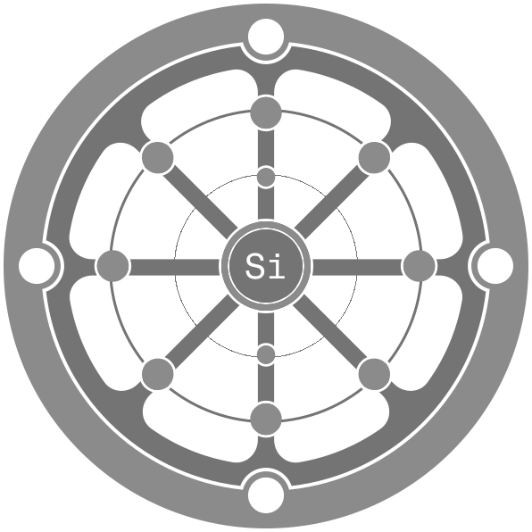

  
  <h1 align="center">The Developer's Silicon Path to Advanced Mathematics and Ultimate Enlightenment</h1>

  The Developer's Silicon Path to Advanced Mathematics and Ultimate Enlightenment, shortened to Silicon Path, is a programming challenge designed to elevate one's mathematical understanding through practical coding projects. Each project serves as a stepping stone, guiding developers from basic concepts to advanced theories, ultimately leading them toward mastery in mathematics and programming.

  This challenge is intended to be a framework for personal improvement and can and should be personalized to your preferences. However, I have some suggestions on how to approach the challenge in the form of (figurative, non-physical, theoretical, self-shoulder-tapping) badges of increasing difficulty:

<ul>
  <li>
    <strong>Trial of Reflection</strong>
     Complete the challenge using the language you feel most comfortable with.
  </li>
  <li>
    <strong>Wind becomes Lightning</strong>
     Complete the challenge using the triforce of development: JavaScript, Python, and Ruby.
  </li>
  <li>
    <strong>Strike the Ivory Tower</strong>
     Complete the challenge using Rust and Go.
  </li>
  <li>
    <strong>Navigate the Untamed Seas</strong>
     Complete the challenge using the 3 C's: C#, C++, and C.
  </li>
  <li>
    <strong>The Silicon Path</strong>
     Complete the challenge using: JavaScript, Python, Ruby, Java, Rust, Go, C++, C#, and C.
  </li>
</ul>

  Each badge has four tiers (I, II, III, IV) awarded for completing each greater topic, so in total, you can earn up to 20 (figurative, non-physical, theoretical, self-shoulder-tapping) badges.

## Basic Fundamentals and the path through the green meadows:

### Basic Arithmetic:
 - Project: Simple Calculator
    - Build a command-line or GUI calculator that performs basic operations (addition, subtraction, multiplication, division) and handles user input and error checking.

### Basic Geometry:
 - Project: Geometry Shapes Area Calculator
    - Create an application that allows users to input dimensions of various shapes (triangles, circles, rectangles) and calculates their perimeter and area, displaying the results in a user-friendly manner.

### Basic Algebra:
 - Project: Algebraic Equation Solver
    - Develop a program that solves linear equations of the form 𝑎𝑥+𝑏=𝑐  and quadratic equations of the form 𝑎𝑥2+𝑏𝑥+𝑐=0.
    Include a graphical representation of the equations and their solutions.

### Basic Functions:
 - Project: Function Plotter
    - Implement a tool that takes a mathematical function as input and generates a plot of the function over a specified range. Use libraries like Matplotlib (Python) or D3.js (JavaScript) for visualization.

## Intermediate concepts and the rising of the tides:

### Plane and Solid Geometry:
 - Project: 2D Shape Analyzer
    - Create a program that accepts coordinates of vertices for various 2D shapes (like triangles and rectangles) and calculates properties such as area, perimeter, and centroid.

### Trigonometry:
 - Project: Trigonometric Functions Visualizer
    - Build an interactive tool that allows users to visualize the sine, cosine, and tangent functions, along with their transformations (shifts, stretches). Include sliders for real-time adjustments.

### Intermediate Algebra:
 - Project: System of Equations Solver
    - Develop a program that can solve systems of linear equations using methods such as substitution, elimination, or matrix operations (Gaussian elimination). Allow input through a simple interface.

### Intermediate Functions:
 - Project: Logarithmic and Exponential Growth Simulator
    - Create a simulation that models real-world phenomena (like population growth) using exponential and logarithmic functions. Display the growth over time with graphs and provide insights.

## Advanced levels and the trials of fire:

### Differential Calculus:
 - Project: Derivative Calculator
    - Implement a tool that computes the derivative of a given function and visualizes the tangent line at a specific point on the graph of the function.

### Integral Calculus:
 - Project: Area Under Curve Calculator
    - Develop a program that estimates the area under a curve using numerical integration methods (like the trapezoidal rule or Simpson's rule) and compares it to the exact area when possible.

### Linear Algebra:
 - Project: Matrix Operations Library
    - Create a library that performs basic matrix operations (addition, multiplication, finding determinants) and provides functionality for eigenvalue and eigenvector calculation.

### Advanced Analytic Geometry:
 - Project: Conic Sections Explorer
    - Build a tool that allows users to input the coefficients of a conic section equation and visualize its graph. Include options to explore properties like vertices, foci, and directrices.

### Probability and Statistics:
 - Project: Data Analysis Tool
    - Create a program that performs statistical analyses on datasets, calculating measures such as mean, median, mode, standard deviation, and displaying visualizations like histograms and scatter plots.

### Differential Equations:
 - Project: ODE Solver
    - Develop a numerical solver for ordinary differential equations, providing options for various methods (Euler's method, Runge-Kutta). Visualize the solutions with graphs.

## Specialized Level and the ascension to the summit:

### Multivariable Calculus:
 - Project: Multivariable Function Visualizer
    - Create a 3D graphing tool that visualizes multivariable functions and allows users to explore level curves and surfaces.

### Number Theory:
 - Project: Cryptography Algorithms Implementer
    - Implement algorithms based on number theory, such as RSA encryption and decryption. Allow users to input plaintext messages and keys, demonstrating the process step by step.

### Real and Complex Analysis:
 - Project: Signal Processing Application
    - Build an application that analyzes signals using Fourier transforms, allowing users to visualize the frequency components of different signals and apply filtering techniques.

### Abstract Algebra:
 - Project: Group Theory Explorer
    - Create a program that explores properties of groups, rings, and fields. Implement basic operations and visualizations for different algebraic structures.

### Topology:
 - Project: Topological Space Visualizer
    - Develop a tool that visualizes concepts from topology, such as open and closed sets, compactness, and continuity. Allow users to manipulate shapes and observe their properties.
